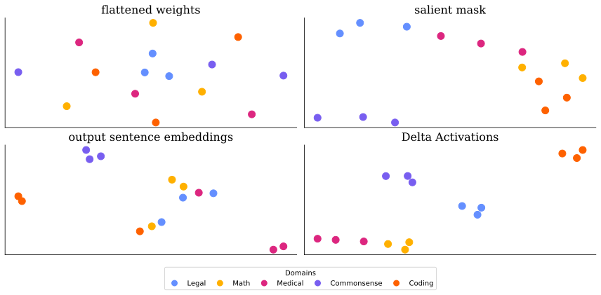

# Delta Activations: A Representation for Finetuned Large Language Models

Official code release for **Delta Activations: A Representation for Finetuned Large Language Models**

Checkout our **[project website](https://oscarxzq.github.io/delta_activation)** for an interactive model embedding navigator!

> [Delta Activations: A Representation for Finetuned Large Language Models](https://arxiv.org/abs/2509.04442)
> <br> [Zhiqiu Xu*](https://oscarxzq.github.io), [Amish Sethi*](https://amishsethi.github.io/personal-website/), [Mayur Naik](https://www.cis.upenn.edu/~mhnaik/), [Ser-Nam Lim](https://sites.google.com/site/sernam)
> <br> University of Pennsylvania, University of Central Florida<br>

<p align="center">

</p>

We introduce **Delta Activations**, a method for embedding finetuned LLMs using activation shifts over a probe dataset.


## Installation

##$ Dependency Setup
Create a new conda virtual environment
```
conda create -n delta_activations python=3.10 -y
conda activate delta_activations
```
Install PyTorch 2.5.0 compatible with your CUDA driver by following the instructions [here](https://pytorch.org/get-started/previous-versions/).
Then install the remaining dependencies:
```
pip install -r requirements.txt
```

## Delta Activations

Reproduction of our main experiment results on `LLaMA-3.1-8B`. Change `--model` to `gemma` and `qwen` to reproduce our results on `Gemma-2-9B` and `Qwen-2.5-7B` model pools.
```
python delta_activations.py --model llama --cuda_devices 0
```

Produce your own embeddings by passing in the list of models you would like to embed. Make sure they are all finetuned from the same base model specified with `--base_model`.
```
python compute_embeddings.py \
    --base_model "meta-llama/Llama-3.1-8B" \
    --models \
        "ASethi04/llama-3.1-8b-legalbench-first" \
        "ASethi04/llama-3.1-8b-legalbench-second" \
        "ASethi04/llama-3.1-8b-legalbench-third" \
        "ASethi04/llama-3.1-8b-gsm8k-first" \
        "ASethi04/llama-3.1-8b-gsm8k-second" \
        "ASethi04/llama-3.1-8b-gsm8k-third" \
        "ASethi04/llama-3.1-8b-pubmedqa-first" \
        "ASethi04/llama-3.1-8b-pubmedqa-second" \
        "ASethi04/llama-3.1-8b-pubmedqa-third" \
        "ASethi04/llama-3.1-8b-hellaswag-first" \
        "ASethi04/llama-3.1-8b-hellaswag-second" \
        "ASethi04/llama-3.1-8b-hellaswag-third" \
        "ASethi04/llama-3.1-8b-opc-first" \
        "ASethi04/llama-3.1-8b-opc-second" \
        "ASethi04/llama-3.1-8b-opc-third" \
    --output_file "llama_embeddings.npz" \
    --verbose
```

## Result

Quantitative evaluation comparing Delta Activations against baseline methods. Results show silhouette scores (measuring cluster quality) across model families.

| Embedding Space | Dimension | LLaMA | Gemma | Qwen | Avg. |
|:----------------|:---------:|:-----:|:-----:|:----:|:----:|
| flattened adapter weights | ~2·10⁷ | -.035 | -.060 | -.034 | -.043 |
| salient mask | ~8·10⁹ | .133 | .208 | .229 | .190 |
| output sentence embeddings | 384* | .221 | -.053 | .096 | .087 |
| **Delta Activations** | **4096** | **.645** | **.545** | **.653** | **.614** |

<p align="center">

</p>
<p align="center">
<em>t-SNE visualization for Gemma model pool</em>
</p>

## Citation
If you find this repository helpful, please consider citing
```
@article{xu2025delta,
  title={Delta Activations: A Representation for Finetuned Large Language Models},
  author={Xu, Zhiqiu and Sethi, Amish and Naik, Mayur and Lim, Ser-Nam},
  journal={arXiv preprint arXiv:2509.04442},
  year={2025}
}
```
